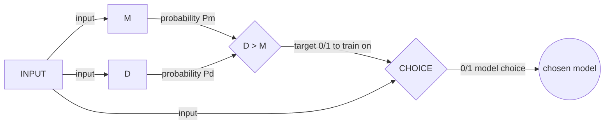

# MD CHOICE

Choose a model for a task that two models can perform but one has to perform better than the other. Use a third model to choose (the better) between the two.

### Example:
I am training two classifiers- 
* One which mimics an OR gate.
* The other mimics an AND gate.

Now, suppose we want a prediction on [1, 1, 1] => that is, 1,1 as input to the logical gate (AND or OR) and the output of both the gates would be 1. 

This example of input is analogous to the problem at hand in the sense that both models are fully capable of providing us the correct output for the input, but they differ in one very particular parameter- the data set they're trained on. This is again analogous to our real problem.

### Analogy:
Now, the problem we have is one **model D** is (should be) better at classifying faces of brown people (however racist this may sound), and the other **model M** at classifying white people. The difference is because of the dataset M was trained on had more samples of white people, and dataset of D would contain more samples of brown people.

*Same is true for this AND OR model-*
The dataset for AND model train-dataset contains the samples for True (output 1) in the ratio of 1:4, and the OR model train-dataset contains the samples for True (output 1) in the ratio 3:4. 
i.e., In theory, if the input is [1,1], the o/p would be 1 from both the models, but the OR model should do (and actually does)  this with more confidence than the AND gate mainly because of the nature of the dataset.

## Viewing it as a binary classification task:
The end goal really is- to be able to predict, given an image, what model (M or D) will be better at (predicting the class) classifying the given face image.
This can be seen as a binary classifier, where the model C outputs 0/1. Here, 1 could mean that the D model will be better, and a 0 means the model M will be a better choice (or !D).

### How to train CHOICE?
Give the 0/1 target label in train data based on the prob of M and D basis the input x.

In simpler terms, treat the C like an independent model that is predicting/classifying if the i/p was better handled by M or D. Just like a binary classifier would classify b/w a cat and a dog (just that the two look very similar in this case).

Let's say we use the logistic (sigmoid) function for the CHOICE model.
* We have i/p data (images).
* We have the target as `(P(d) > P(m)) ? 1:0`
 

TODO!
* The act function? => softmax => sigmoid h(x) since it is binary classification
* loss fn? => 1 - h(x) since it is the error in expected probability and predicted probability?! OR we can use derivative of the h(x)?! OR, what is even better is, we use cross entropy -log liklihood; the 2pg derivation I did while doing the linear classification task but ended up using the loss function as defined in the textbook instead. That works here!
* then just calc. the 2 pg derivative of it. but the goal is to get the loss func and we have that now. I think.

So, for GD, we get the cost function as:
$$\frac{\delta}{\delta w_i} Loss(w)=\frac{\delta}{\delta w_i}(y - h_w(x))^2$$
Applying chain rule $$\frac{\delta_g(f(x))}{\delta x} = g' (f(x))\frac{\delta f(x)}{\delta x}$$

... solving this we get-  $$-2(y-h_w(x)) * g'(w.x)*x_i$$
(where, g'(f(x)) is the derivative of the outer function)

And, derivative of a logistic fn- g(z) satisfies $g'(z) = g(z) . (1-g(z))$  

now, plugging in the values of the logistic fn (in h(x)) we get the equation to update the weight for minimizing the loss - 
$$w_i \leftarrow w_i + lr(y-h_w(x)) * (h_w(x)).(1-(y-h_w(x)) * x_i$$
The same equation is used in the code as well to update the coeff.
