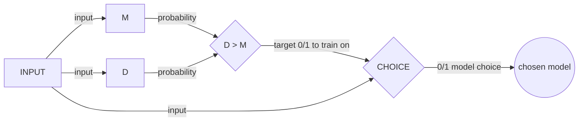

# MODEL DELTA CHOICE

How to train CHOICE?
give the 0/1 target label in train data based on the prob of M and D basis the input x.

In simpler terms, treat the C like an independent model that is predicting/classifying if the i/p was better handled by M or D. Just like a binary classifier would classify b/w a cat and a dog (just that the two look very similar in this case). When it is trained enough, and is making accurate predictions, then use it in the system.

Let's say we use the logistic (sigmoid) function for the CHOICE model.
* We have i/p data(images (N vectors?/NM Mats?)).
* We have the target as `(p(D) > p(M)) ? 1:0`
 

So, for GD, we get the cost function as:
$$\frac{\delta}{\delta w_i} Loss(w)=\frac{\delta}{\delta w_i}(y - h_w(x))^2$$
Applying chain rule $$\frac{\delta_g(f(x))}{\delta x} = g' (f(x))\frac{\delta f(x)}{\delta x}$$

... solving this we get-  $$-2(y-h_w(x)) * g'(w.x)*x_i$$
(where, g'(f(x)) is the derivative of the outer function)

And, derivative of a logistic fn- g(z) satisfies $g'(z) = g(z) . (1-g(z))$  

now, plugging in the values of the logistic fn (in h(x)) we get the equation to update the weight for minimizing the loss - 
$$w_i \leftarrow w_i + lr(y-h_w(x)) * (h_w(x)).(1-(y-h_w(x)) * x_i$$
The same equation is used in the code as well to update the coeff.
