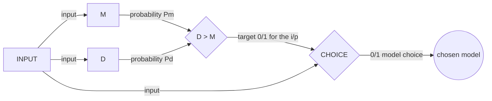

# MD CHOICE
Choose a model for a task that two models can perform but one has to perform better than the other. Use a third model to choose (the better) between the two.

### Example:
I am training two classifiers- 
* One which mimics an OR gate.
* The other mimics an AND gate.

Now, suppose we want a prediction on [1, 1, 1] => that is, 1,1 as input to the logical gate (AND or OR) and the output of both the gates would be 1. 

This example of input is analogous to the problem at hand in the sense that both models are fully capable of providing us the correct output for the input, but they differ in one very particular parameter- the data set they're trained on. This is again analogous to our real problem.

### Analogy:
Now, the problem we have is one **model D** is (should be) better at classifying faces of brown people (however racist this may sound), and the other **model M** at classifying white people. The difference is because of the dataset M was trained on had more samples of white people, and dataset of D would contain more samples of brown people.

*Same is true for this AND OR model-*
The dataset for AND model train-dataset contains the samples for True (output 1) in the ratio of 1:4, and the OR model train-dataset contains the samples for True (output 1) in the ratio 3:4. 
i.e., In theory, if the input is [1,1], the o/p would be 1 from both the models, but the OR model should do (and actually does)  this with more confidence than the AND gate mainly because of the nature of the dataset.

## Viewing it as binary classification:
The end goal really is- to be able to predict, given an image, what model (M or D) will be better at (predicting the class) classifying the given face image.
This can be seen as a binary classifier, where the model C outputs 0/1. Here, 1 could mean that the D model will be better, and a 0 means the model M will be a better choice.

### How to train CHOICE?
The general idea for an approach to train C is shown in the flow chart below.

Give the 0/1 target label in train data based on the probability/score of M and D basis the input x. So, we have - 
* The i/p data (images).
* The target as `(P(d) > P(m)) ? 1:0` for every i/p.

In simpler terms, treat the C like an independent model that is predicting/classifying if the i/p on the basis of whether the input was better handled by M or D. Just like a binary classifier would classify b/w any two things.

## The loss function for CHOICE

#### Cross Entropy ( w/ sigmoid).
CE is, in a way, the measure of surprise. Like how surprised are we seeing the predicted result (we should not be surprised seeing an expected (correct) result!).

CE especially penalises the predictions that are confident and wrong more. This design sort of advises our model to not only make the right predictions, but also be confident about the predictions.

Our model computes probabilities over all input x (image) and is trained to minimize the cross-entropy between the predicted and actual distribution (the sigmoid function gives us a probability that an input x belongs to a certain class). As shown in the graph, when the error is high, the slope is rather sharp/steep and that motivates the GD algo to take larger steps towards convergence (minima).

**CE Loss is given as:**
$$CE Loss=\frac{1}{N}\sum^N_i-(y_i*log(p_i)+(1-y_i)*log(1-p_i))$$
Here, 

$y_i =$ The correct target value (1/0)

$p_i=$ The predicted probability/value (between 0-1).

The $y_i*log(p_i)$ part in the function activates when the o/p should be 1, 
and the $(1 - y_i) * log(1-p_i)$ part activates when the o/p should be 0. 

The terms $y_i$ 
and $(1-y_i)$ are added to cancel the other term so they don't interfere with each other.

## Why CE Loss and not just MSE?

The MSE, while gives the actual error (actual prob - predicted prob), the loss values are not "high" enough (esp when the estimates are way off the real values) to get the GD convegre faster. As shown in the graph below, the error values for both are plotted. The MSE gives a relatively less value when the model predicted a wrong class with high confidence, while the CE loss values are especially higer for such cases.

The actual value for y is 1.

